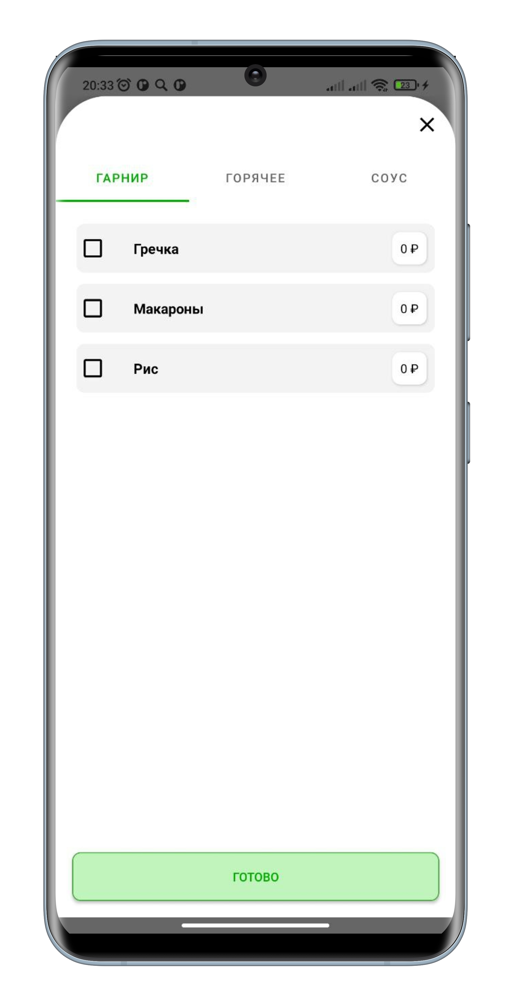
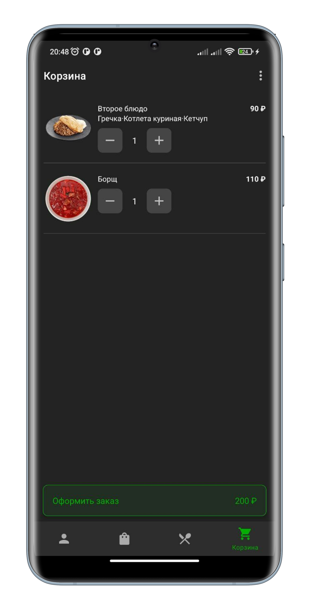

<h1 align="center">Restaurant</h1>

## Общее описание

Приложение предназначено для одной точки питания. С помощью данного приложения можно делать заказы из данной точки питания.

    
    
    

    
    
    

## Описание работы

Приложение имеет 4 основных раздела, переключаться между которыми можно с помощью нижнего меню.
Имеющиеся разделы(слева направо): профиль, заказы, меню, корзина.

Первоначально, при открытии приложения, открывается меню в виде списка категорий. После выбора категории открывается страница с блюдами.

    
    

    
    

При нажатии на цену блюдо автоматически складывается в корзину, если у данного блюда нет опций для выбора (например, выбрать гарнир или соус). Если у блюда есть опции для выбора или нажатие было на саму карточку блюда, то снизу выезжает страница выбора опций блюда и его количества. При нажатии на опцию блюда, снизу выезжает страница с выбором необходимых вариантов. После выбора необходимых вариантов и нажатии кнопки Готово, блюдо складывается в корзину и вновь открывается страница со списком блюд в выбранной категории.

    
    

    
    

Чтобы просмотреть содержимое необходимо выбрать корзину в правом верхнем углу приложения, либо в нижнем меню навигации.

    
    

    
    

При нажатии на кнопку Оформить заказ, если пользователь авторизован, открывается страница создания заказа, на которой можно выбрать способ получения заказа (доставка или замовывоз) и необходимое время.

    
    

Если пользователь не авторизован, то откроется страница авторизации, в которой необходимо ввести свой номер телефона, на который будет отправлено СМС с кодом авторизации. Далее будет необходимо ввести код авторизации, но если на телефоне установлены Google Play сервисы, то достаточно будет ввести только номер телефона.

    
    

    
    

